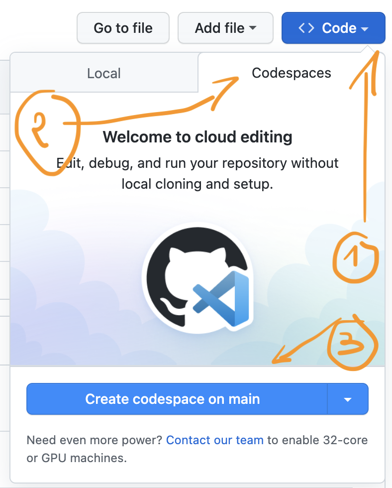

# :clown_face: Paradigmes

:a: À l'aide de [:point_right: codespace](https://github.com/codespaces), crée un environnement de dévelopement en utilisant [VSC](https://code.visualstudio.com/)

 </img>

:b: Entreprends les exercices de programmation suivants

| Paradigme | Impérative                       | Déclarative                            | Exercices   | 
|-----------|----------------------------------|----------------------------------------|-------------|
|           | :one: [Procédurale](procedurale) |                                        | Concevoir des codes de programmes qui utilisent des modules et objets |
|           | :two: [Orientée Objet](oo)       |                                        | Découper un problème en plus petits sous-problèmes |
|           |                                  | :three: [Fonctionnelle](fonctionnelle) | Concevoir des fonctions  |
|           |                                  | :four: [Logique](db) |

:bulb: Laboratoires

Puisque nous ne serons pas dans un laboratoire d’informatique, vous pouvez décrire les activités pratiques que vous proposez en lien avec votre mini-leçon.

# References

- [ ] [Introduction of Programming Paradigms](https://www.geeksforgeeks.org/introduction-of-programming-paradigms/)
- [ ] [Differences between Procedural and Object Oriented Programming](https://www.geeksforgeeks.org/differences-between-procedural-and-object-oriented-programming/)
- [ ] [Imperative vs. declarative Kubernetes commands: What's the difference?](https://www.theserverside.com/blog/Coffee-Talk-Java-News-Stories-and-Opinions/Imperative-vs-declarative-Kubernetes-commands-Whats-the-difference)
- [ ] [Declarative Query Languages: Definition and Examples](https://neo4j.com/blog/imperative-vs-declarative-query-languages/#:~:text=SQL%20(Structured%20Query%20Language)%20is,features%2C%20as%20mentioned%20above)
